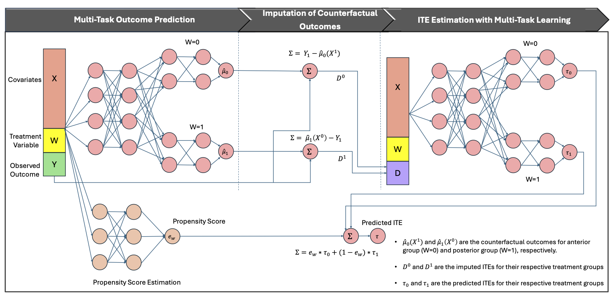

# X-MultiTask Learner
We propose a multi-task meta-learning, `X-MultiTask`. A framework for ITE estimation that models each treatment decision (e.g., anterior vs. posterior approach, surgery vs. no surgery) as a distinct task while learning shared representations across tasks. To strengthen causal validity, we incorporate inverse probability weighting into the training objective.



## Preprocessing
---
The script `preprocessing.py` preprocesses raw clinical data stored in a `.tar.gz` archive, applies a series of transformations, and outputs the processed data as a CSV file. It is designed to handle data from multiple sources, including patient labs, information, medications, procedure events, and post-operative complications.

### Input Data Structure
The `.tar.gz` archive should contain the following CSV files:

- `patient_labs.csv`: Laboratory test results for patients.
- `patient_info.csv`: Demographic and clinical information about patients.
- `procedure_events.csv`: Records of procedures performed on patients.
- `patient_medications.csv`: Information about medications prescribed to patients.
- `post_op_complications.csv`: Details of post-operative complications observed in patients.
- `patient_history.csv`: Longitudinal medical history including prior diagnoses and relevant past events.
- `patient_lda.csv`: Latent Dirichlet Allocation (LDA) topics or distributions extracted from clinical notes.
- `patient_coding.csv`: Billing or diagnosis codes (e.g., ICD-10 or CPT), potentially for risk adjustment.
- `patient_visit.csv`: Visit-level metadata, including encounter type (inpatient, outpatient) and timestamps.

### Usage
- **Command-Line Arguments**
    
    The script accepts two positional arguments:

    - input_dir: Path to the `.tar.gz` file containing the raw data.
    - output_dir: Path to the directory where the preprocessed data will be saved.
- **Running the Script**

    Execute the script from the command line:
    ```sh
    python preprocessing/preprocessing.py <input_dir> <output_dir>
    ```
- **Output**

  It saves (X, y, w) training and testing tuples in `output_dir`.
## Training
---

Execute the script from the command line:
```sh
python run_training.py \
  --data_dir ./temp_data \
  --output_dir ./train_out/run_01 \
  --learner SLearner \
  --config ./configs/learners_config.json \
  --propensity_model_path ./models/propensity_nn_model.pth
```

## Testing
---
Execute the script from the command line:
```sh
python run_testing.py \
  --checkpoint ./train_out/run_04/checkpoints_XMultiTaskLearner \
  --data_dir ./temp_data \
  --output_dir ./test_out/run_04 \
  --learner XMultiTaskLearner \
  --config ./configs/learners_config.json \
  --propensity_model_path ./models/propensity_nn_model.pth
```
## Citation
---
Please consider citation if our paper is useful in your research.
```sh
@article{tamo2025causal,
  title={Causal Machine Learning for Surgical Interventions},
  author={Tamo, J Ben and Chouhan, Nishant S and Nnamdi, Micky C and Yuan, Yining and Chivilkar, Shreya S and Shi, Wenqi and Hwang, Steven W and Brenn, B Randall and Wang, May D},
  journal={arXiv preprint arXiv:2509.19705},
  year={2025}
}
```
